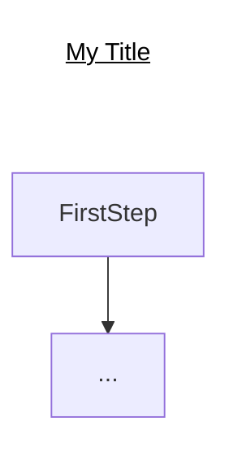
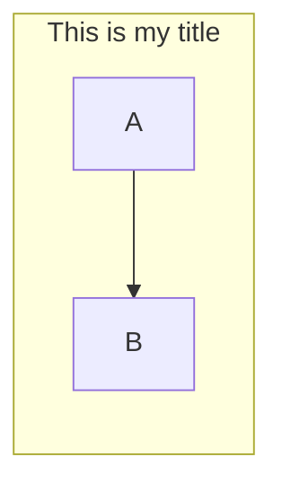

# GitHub Charts Using Mermaid

Presentation content for Mermaid, the clever chart visualization for Markdown syntax, for specific use in GitHub

  

## Two Ways to Add a Chart Title

from https://github.com/mermaid-js/mermaid/issues/177

