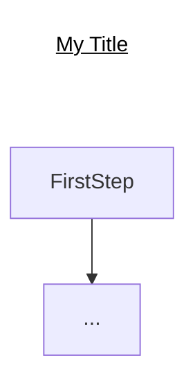
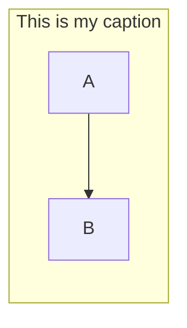

# GitHub Charts using Mermaid
Presentation content for Mermaid, the clever chart visualization for Markdown syntax, for specific use in GitHub

  
## Two Ways to Add a Chart Title
from https://github.com/mermaid-js/mermaid/issues/177

