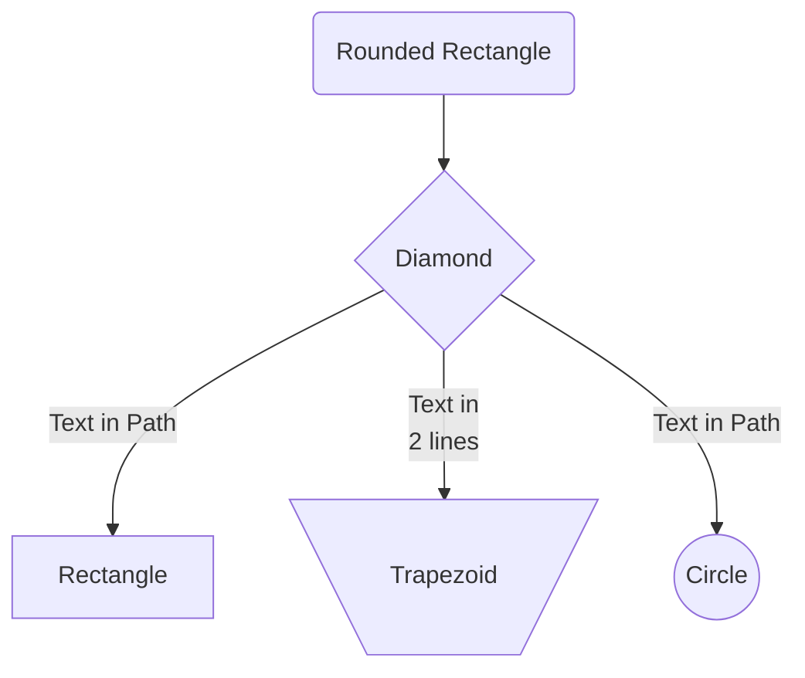
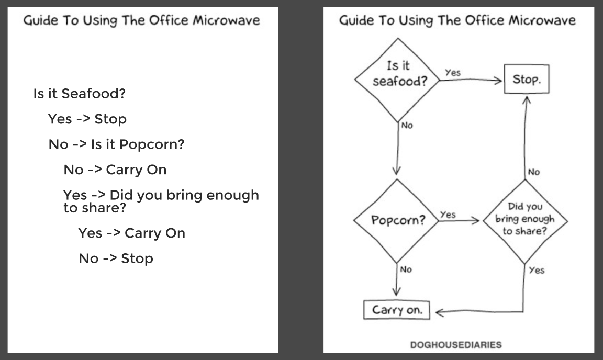
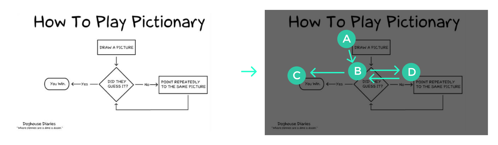
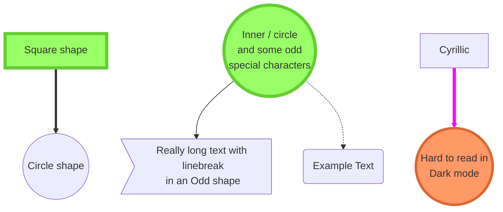
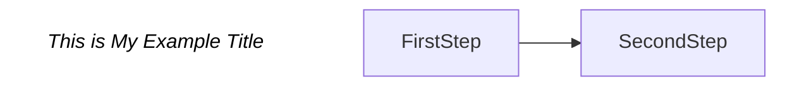
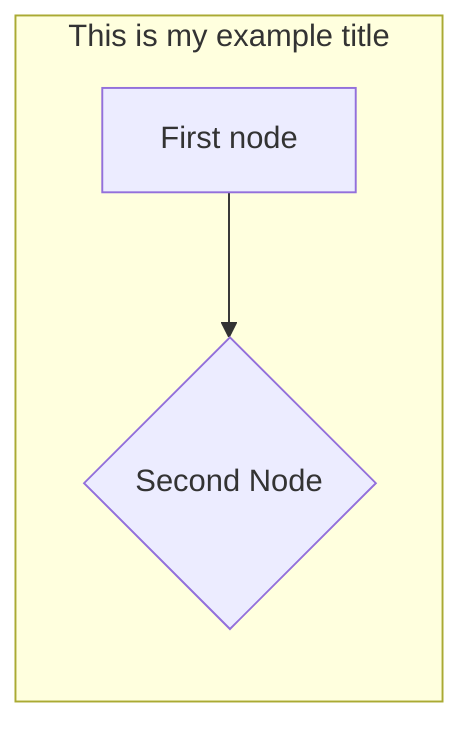
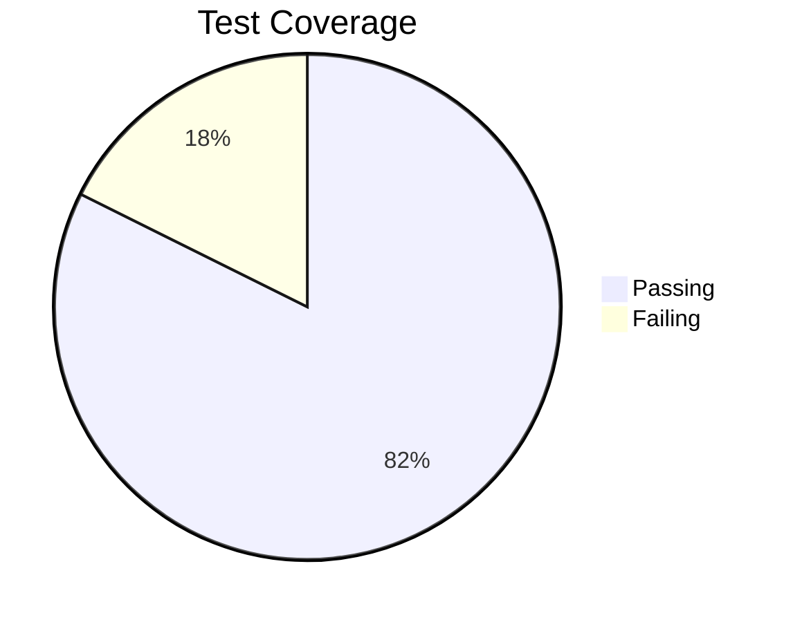

# GitHub Charts Using Mermaid

Presentation content for Mermaid, the clever chart visualization for Markdown syntax, for specific use in GitHub



<br><br>

## Where It All Started

-   For over 6 years, Mermaid has been around as a Javascript library for charting
-   Plant UML, a great tool but... [[example of limitations]](https://ardalis.com/github-diagrams-with-mermaid/)
-   GitHub's 2022 Valentine's Day gift (⚙️built in)

<br><br>

## Pictures & Charts are Powerful

Both of these images show the same content... but do they?



<br><br>

## Converting a Sketch to a Mermaid Chart



<br><br>
<br><br>
<br><br>

## What Other Kinds of Charts are Available???

<br><br>
<br><br>
<br><br>
<br><br>

<br><br>

## Helpful Tips

### _Color Carefully_

This example uses stylized coloring of the components, This should be tested in both **light** and **dark** mode. When you change the backgorund color of a node, for example, the text color may need to be set also.



<br><br>

### _Two Ways to Add a Chart Title_

from https://github.com/mermaid-js/mermaid/issues/177



```js
graph LR

title[<i>This is My Example Title</i>]
title --> FirstStep

%% this styling hides the connection arrow for link index 0
style title fill:#FFF,stroke:#FFF,color:#000
linkStyle 0 stroke:#FFF,stroke-width:0;

FirstStep --> SecondStep
```

<br>



```js
graph LR

  subgraph This is my example title
    A[First node] --> B{Second Node}
  end
```

<br><br>

### _Places to Use it in GitHub_

-   README.md documentation
-   Comments in Pull Requests
-   GitHub Actions for Visualization



<br><br>

## Resources

<a href="https://mermaid-js.github.io/mermaid/" target="_blank"></a>
<a href="https://github.blog/2022-02-14-include-diagrams-markdown-files-mermaid/" target="_blank"></a>
<a href="https://mermaid-js.github.io/mermaid-live-editor/" target="_blank"></a>
<a href="https://jojozhuang.github.io/tutorial/mermaid-cheat-sheet/" target="_blank"></a>

<br><br>

## Further Learning (100% Free)

<a href="https://www.youtube.com/watch?v=eJojC3lSkwg" target="_blank"></a>
<a href="https://wesbos.com/mastering-markdown" target="_blank"></a>
<a href="https://www.youtube.com/playlist?list=PLUoebdZqEHTxNC7hWPPwLsBmWI0KEhZOd" target="_blank"></a>

<br><br>

## VSCode Extensions

 Markdown Preview GitHub Styling https://marketplace.visualstudio.com/items?itemName=bierner.markdown-preview-github-styles

 Markdown Preview Mermaid Support https://marketplace.visualstudio.com/items?itemName=bierner.markdown-mermaid
