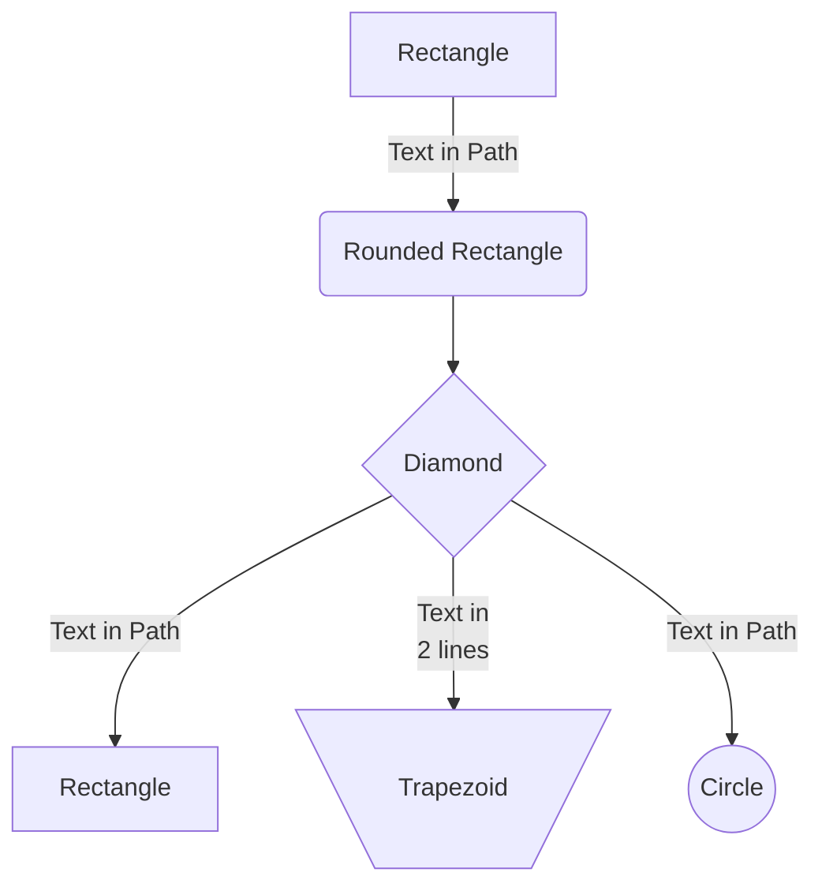

# GitHub Charts Using Mermaid

Presentation content for Mermaid, the clever chart visualization for Markdown syntax, for specific use in GitHub

```mermaid
graph TD
title(Outline)
title-->A[Where It All Started]
style title fill:#A6EDBE,stroke:#FFF,color:#003F5F,stroke-width:0
linkStyle 0 stroke:#FFF,stroke-width:0;

A --> B(Pictures & Charts are Powerful)
B --> C{Are pictures<br>better?}
C -. Yes .-> E
C -. No .-> D

style C fill:#1c1c1c

classDef orange fill:#f96,stroke:#d1d1d1,stroke-width:4px,color:#333
class C orange

```





<br><br>

## Where It All Started

-   For over 6 years, Mermaid has been around as a Javascript library for charting
-   Plant UML, a great tool but...
-   GitHub's 2022 Valentine's Day gift

<br><br>

## Pictures & Charts are Powerful


Demo of coding a hand drawn chart in VSCode with preview tools

Show how to do it with Live Editor

Review what & why we learned it

Discuss further learning, resources & documentation

Questions

<br><br>

## Helpful Tips

### _Color Carefully_

This example uses stylized coloring of the components, This should be tested in both **light** and **dark** mode. When you change the backgorund color of a node, for example, the text color may need to be set also.


<br><br>

### _Two Ways to Add a Chart Title_

from https://github.com/mermaid-js/mermaid/issues/177


```js
graph LR

title[<i>This is My Example Title</i>]
title --> FirstStep

%% this styling hides the connection arrow for link index 0
style title fill:#FFF,stroke:#FFF,color:#000
linkStyle 0 stroke:#FFF,stroke-width:0;

FirstStep --> SecondStep
```

<br>


```js
graph LR

  subgraph This is my example title
    A[First node] --> B{Second Node}
  end
```

<br><br>

### _Places to Use it in GitHub_

-   README.md documentation
-   Comments in Pull Requests
-   GitHub Actions for visualization


<br><br>

## Resources

<a href="https://mermaid-js.github.io/mermaid/"></a>
<a href="https://github.blog/2022-02-14-include-diagrams-markdown-files-mermaid/"></a>
<a href="https://mermaid-js.github.io/mermaid-live-editor/"></a>
<a href="https://jojozhuang.github.io/tutorial/mermaid-cheat-sheet/"></a>

<br><br>

## Further Learning (100% Free)

<a href="https://www.youtube.com/watch?v=eJojC3lSkwg"></a>
<a href="https://wesbos.com/mastering-markdown"></a>
<a href="https://www.youtube.com/playlist?list=PLUoebdZqEHTxNC7hWPPwLsBmWI0KEhZOd"></a>

<br><br>

## VSCode Extensions

 Markdown Preview GitHub Styling https://marketplace.visualstudio.com/items?itemName=bierner.markdown-preview-github-styles

 Markdown Preview Mermaid Support https://marketplace.visualstudio.com/items?itemName=bierner.markdown-mermaid
