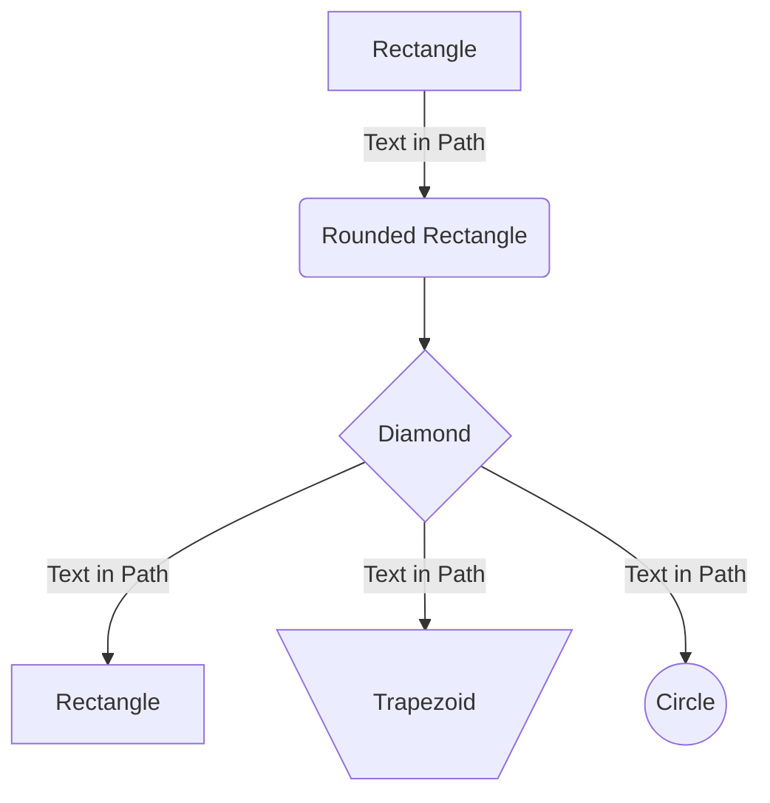
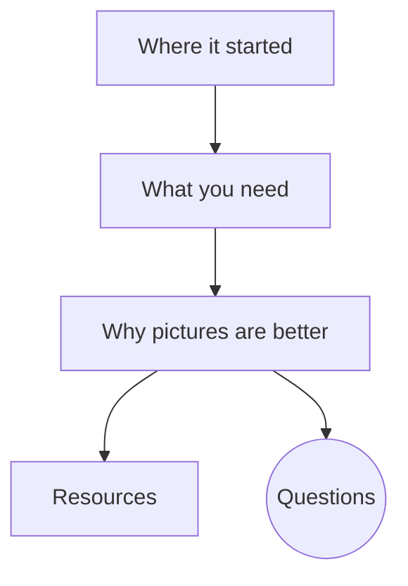
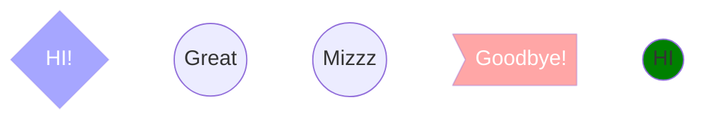
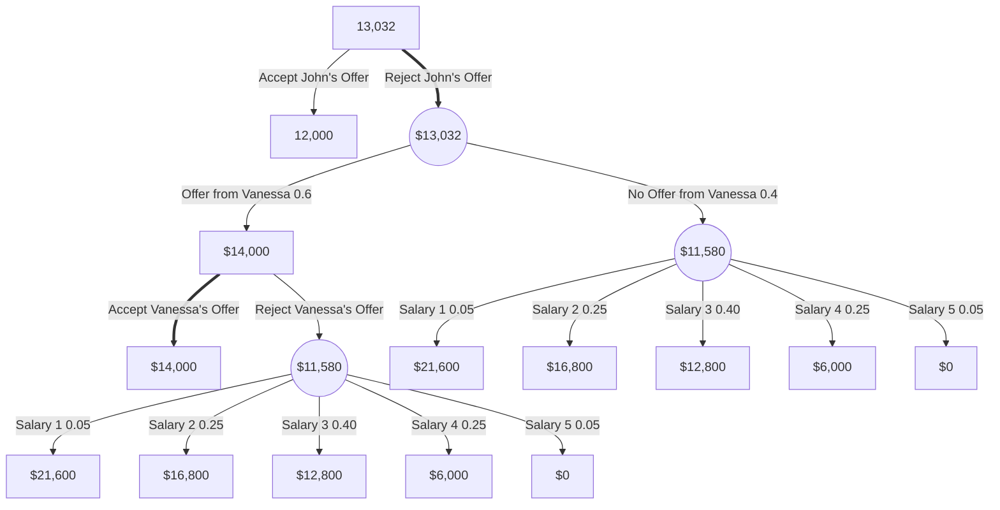
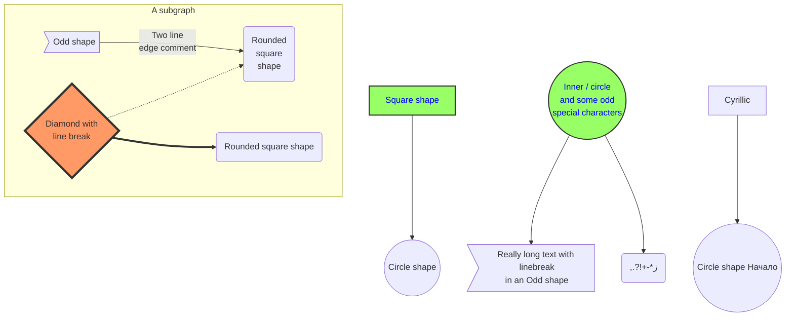

Short story of where it all started

Pictures & Charts are powerful, give example (maybe words describing a chart)

Demo of coding a hand drawn chart in VSCode with preview tools

Show how to do it with Live Editor

Review what & why we learned it

Discuss further learning, resources & documentation

Questions

---

Where it started: https://github.community/t/feature-request-support-mermaid-markdown-graph-diagrams-in-md-files/1922

### _Pre-work if you would like to follow along_

1. Download and install the VSCode Extensions listed below

    1. [Markdown Preview GitHub Styling](https://marketplace.visualstudio.com/items?itemName=bierner.markdown-preview-github-styles)

    1. [Markdown Preview Mermaid Support](https://marketplace.visualstudio.com/items?itemName=bierner.markdown-mermaid)

1. Create a DEMO.md file in VSCode

---

GitHub Blog: https://github.blog/2022-02-14-include-diagrams-markdown-files-mermaid/

Mermaid GitHub Website Documentation: https://mermaid-js.github.io/mermaid/#/

Mermaid Live Editor: https://mermaid-js.github.io/mermaid-live-editor/

Mermaid Cheat Sheet: https://jojozhuang.github.io/tutorial/mermaid-cheat-sheet/

Article discussing the advantages of using Mermaid: https://ardalis.com/github-diagrams-with-mermaid/

In the Future: Font Awesome? https://github.com/mermaid-js/mermaid/issues/1435

VSCode Extensions

Markdown Preview GitHub Styling: https://marketplace.visualstudio.com/items?itemName=bierner.markdown-preview-github-styles

Markdown Preview Mermaid Support: https://marketplace.visualstudio.com/items?itemName=bierner.markdown-mermaid

---

### _Extra Learning_

Free Markdown Course: https://wesbos.com/mastering-markdown

▶️ Learning GitHub Markdown: https://www.youtube.com/watch?v=eJojC3lSkwg

---

---

## Guide To Using The Office Microwave

-   Is it Seafood?

    -   If yes, then stop

    -   If no, then proceed to next question

-   Is it Popcorn?

    -   If no, then carry on

    -   If yes, then

        -   Did you bring enough to share?

            -   If yes, then carry on

            -   If no, then stop

---

-   Is it Seafood?

    -   Yes -> Stop

    -   No -> Is it Popcorn?

        -   No -> Carry On

        -   Yes -> Did you bring enough to share?

            -   Yes -> Carry On

            -   No -> Stop

How many scenarios end in “Stop”? “Carry on”?

---

