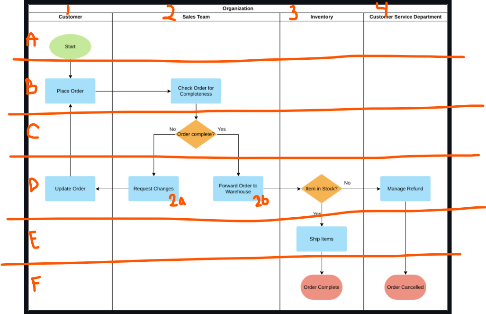
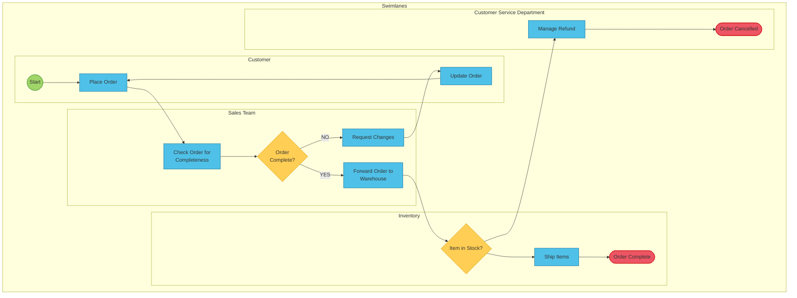

# Attempt to Make a Swimlane with Mermaid

based on: https://github.com/mermaid-js/mermaid/issues/2028

```mermaid
flowchart TD
    b1-->b2
    d2a-->d1
    d2b-->d3
    d3-->d4
    subgraph Swimlanes
        subgraph Customer
        a1((Start))-->b1[Place Order]
        d1[Update Order]-->b1
        end

        subgraph Sales Team
        %% blank for height
        a2---b2

        b2[Check Order for <br> Completeness]-->c2{Order <br> Complete?}
        c2--NO-->d2a[Request Changes]
        c2--YES-->d2b[Forward Order to <br> Warehouse]
        end

        subgraph Inventory
        %% blank for height
        a3---b3---c3
        c3---d3

        d3{Item in Stock?}-->e3
        e3[Ship Items]-->f3([Order Complete])
        end

        subgraph Customer Service Department
        a4---b4---c4
        c4---d4
        d4[Manage Refund]---->f4([Order Cancelled])
        end
    end

    classDef red fill:#ed5564,color:#333,stroke:#c00;
    classDef green fill:#a0d568,color:#333,stroke:#060;
    classDef blue fill:#4fc1e8,color:#333,stroke:#069;
    classDef yellow fill:#ffce54,color:#333,stroke:#c90;
    classDef purple fill:#ac9eb,color:#333,stroke:#609;
    classDef blank fill:none,color:none,stroke:none,stroke-width:0,font-size:0;

    class f3,f4 red
    class a1 green
    class d3,c2 yellow
    class b1,b2,d1,d2a,d2b,d4,e3 blue
    class a2,a3,b3,c3,a4,b4,c4 blank

    %% this styling hides the connection arrow
    %% do this at the very end
    linkStyle 6,10,11,12,15,16,17 stroke-width:0;
```
